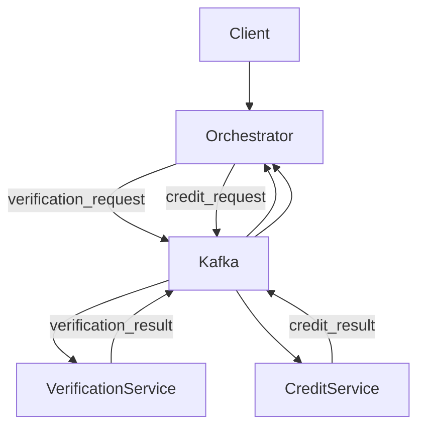
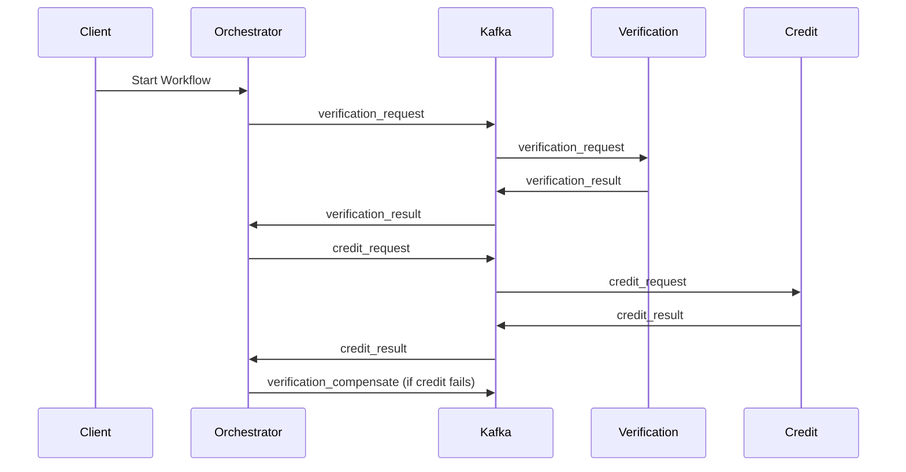

# FlowMaster — Distributed Workflow Orchestrator

FlowMaster is a **distributed workflow orchestration system** built using **microservices and event-driven architecture**.

The system demonstrates how multiple services can coordinate tasks asynchronously using **Apache Kafka** while maintaining workflow state in **PostgreSQL**.

The project simulates a **loan approval workflow** consisting of verification and credit checking steps, while implementing real distributed systems patterns like:

* Event-driven communication
* Saga orchestration with compensation
* Workflow persistence
* Retry logic
* Dead-letter queues
* YAML-driven workflow definitions

---

# System Architecture



---

# Workflow Event Flow



---

# Architecture Overview

The system follows an **event-driven microservices architecture**.

Services communicate **asynchronously through Kafka topics**, ensuring loose coupling and scalability.

```
Client
 ↓
Orchestrator Service
 ↓
Kafka Event Bus
 ↓
Verification Service
 ↓
Kafka
 ↓
Credit Service
```

---

# Components

## 1. Orchestrator Service

The orchestrator acts as the **workflow engine**.

Responsibilities:

* Start workflows
* Load workflow steps from YAML
* Track workflow state in PostgreSQL
* Trigger next workflow steps
* Handle failures and compensation logic

Runs on:

```
http://localhost:3000
```

---

## 2. Verification Service

Simulates identity verification.

Responsibilities:

* Consume `verification_request`
* Process verification logic
* Emit `verification_result`
* Handle compensation events

Runs on:

```
http://localhost:3001
```

---

## 3. Credit Service

Simulates credit approval.

Responsibilities:

* Consume `credit_request`
* Process credit evaluation
* Emit `credit_result`

Runs on:

```
http://localhost:3002
```

---

## 4. Apache Kafka

Kafka acts as the **event bus** enabling asynchronous communication.

Kafka Topics:

```
verification_request
verification_result
credit_request
credit_result
verification_compensate
workflow_dead_letter
```

---

## 5. PostgreSQL

PostgreSQL stores workflow state so that workflows can be **recovered after crashes**.

Workflow table schema:

| workflow_id | step | status | retry_count | created_at |
| ----------- | ---- | ------ | ----------- | ---------- |

---

# Technologies Used

* Node.js
* Express.js
* Apache Kafka
* KafkaJS
* PostgreSQL
* Docker
* YAML
* Microservices Architecture
* Event-Driven Architecture
* Saga Pattern
* Retry Mechanism
* Dead Letter Queue (DLQ)

---

# Project Structure

```
flowmaster
│
├── docker-compose.yml
│
├── orchestrator-service
│   ├── app.js
│   ├── kafka.js
│   ├── workflowExecutor.js
│   ├── workflowLoader.js
│   ├── workflow.yaml
│   └── db.js
│
├── verification-service
│   ├── app.js
│   └── kafka.js
│
├── credit-service
│   ├── app.js
│   └── kafka.js
│
└── README.md
```

---

# Setup Instructions

## 1. Clone Repository

```bash
git clone <repository_url>
cd flowmaster
```

---

## 2. Start Infrastructure

Start Kafka, Zookeeper, and PostgreSQL:

```bash
docker compose up -d
```

Verify containers:

```bash
docker ps
```

Expected containers:

```
kafka
zookeeper
postgres
```

---

## 3. Install Dependencies

Install dependencies for each service.

```bash
cd orchestrator-service
npm install

cd ../verification-service
npm install

cd ../credit-service
npm install
```

---

## 4. Start Services

Run services in separate terminals.

Terminal 1

```bash
cd orchestrator-service
node app.js
```

Terminal 2

```bash
cd verification-service
node app.js
```

Terminal 3

```bash
cd credit-service
node app.js
```

---

# Running a Workflow

Start a workflow:

```bash
curl -X POST http://localhost:3000/workflow/start
```

Example response:

```
{
  "message": "Workflow started",
  "workflowId": "d5289119-bc23-48c4-9779-453e8c42f137"
}
```

---

# Workflow Execution

1. Orchestrator publishes `verification_request`
2. Verification Service processes request
3. Verification Service emits `verification_result`
4. Orchestrator publishes `credit_request`
5. Credit Service processes request
6. Credit Service emits `credit_result`
7. Orchestrator marks workflow as completed

---

# Failure Handling

The system implements the **Saga Orchestration Pattern**.

Example failure flow:

```
verification → success
credit → rejected
↓
verification_compensate
```

If a step fails:

1. Retry logic attempts execution
2. After max retries, workflow is sent to a **Dead Letter Queue**

---

# Reliability Features

The system includes production-style reliability mechanisms:

### Retry Mechanism

Failed tasks are retried automatically.

### Saga Compensation

Completed steps can be rolled back if a later step fails.

### Dead Letter Queue (DLQ)

Messages that fail repeatedly are sent to:

```
workflow_dead_letter
```

---

# YAML Workflow Engine

Workflows are defined dynamically using YAML.

Example:

```
workflow:
  steps:
    - name: verification
      request_topic: verification_request
      response_topic: verification_result

    - name: credit
      request_topic: credit_request
      response_topic: credit_result
```

This allows workflows to be modified **without changing code**.

---

# Future Improvements

* Workflow dashboard UI
* Observability and metrics
* Distributed tracing
* Multi-step parallel workflows
* Dynamic workflow creation via API

---

# Author

Developed as part of a **distributed systems project demonstrating microservices orchestration using Kafka**.
